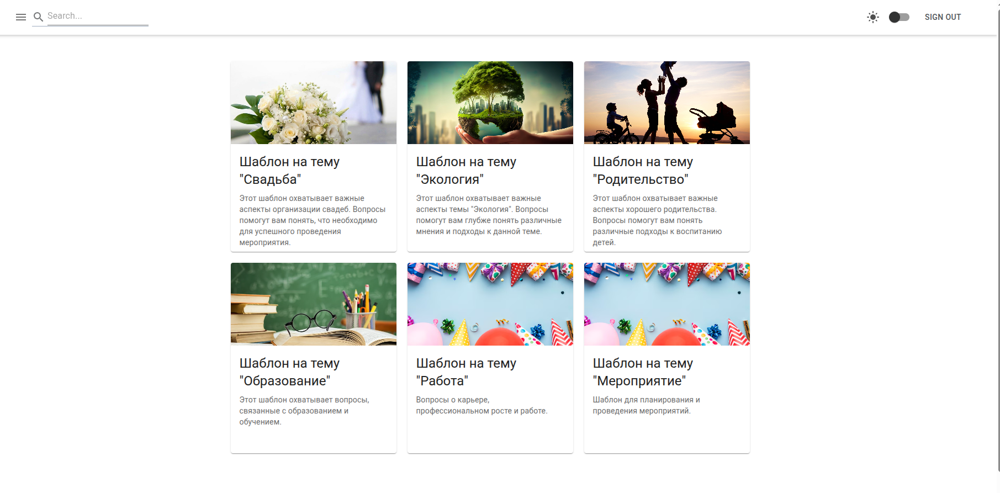
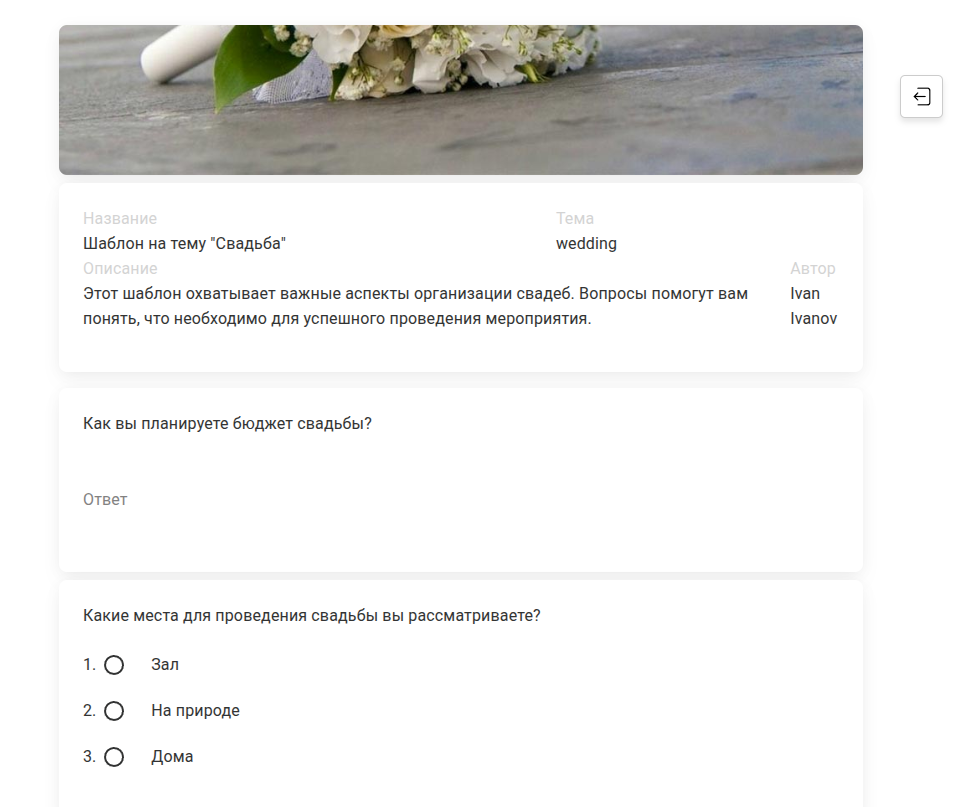
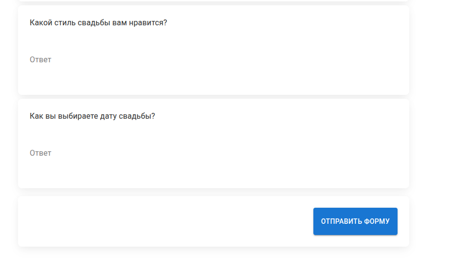
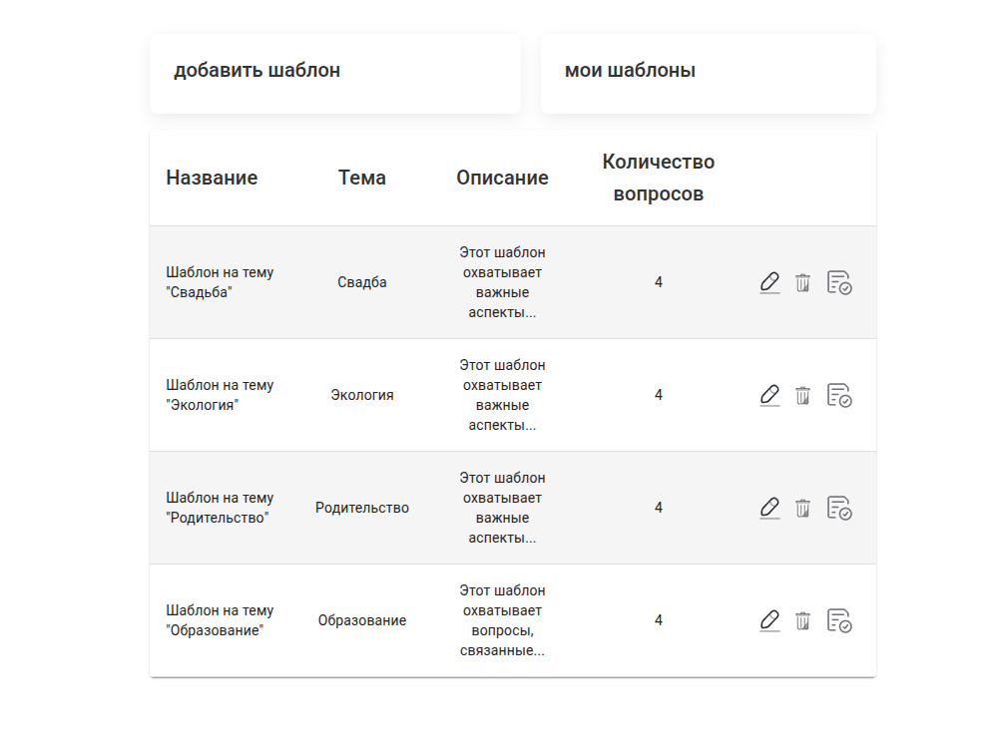
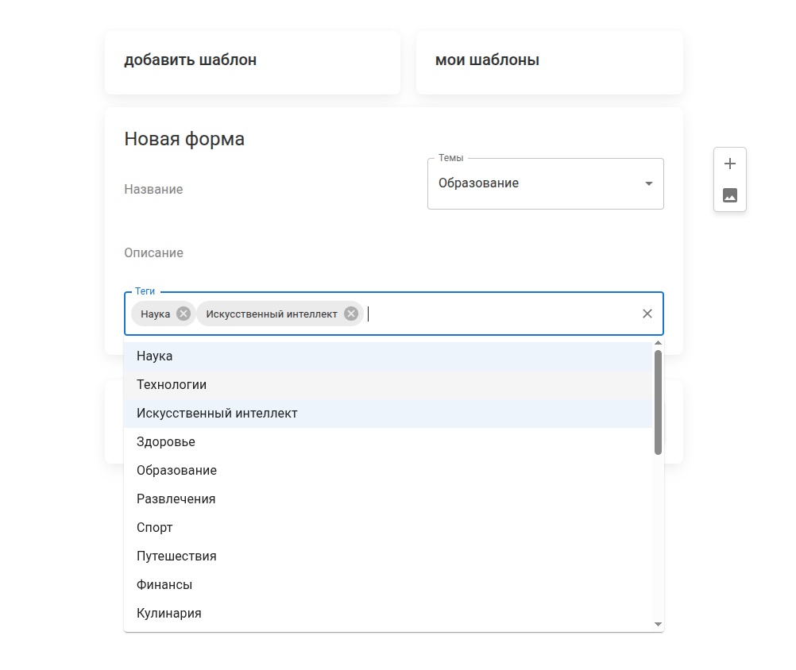
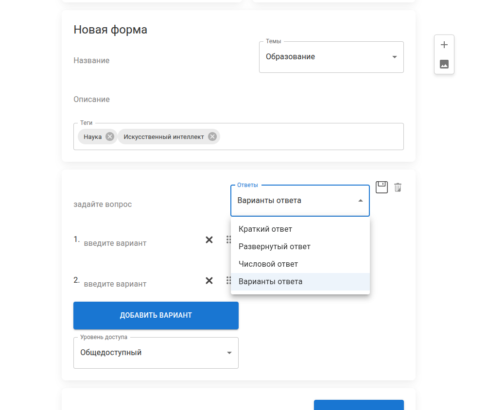
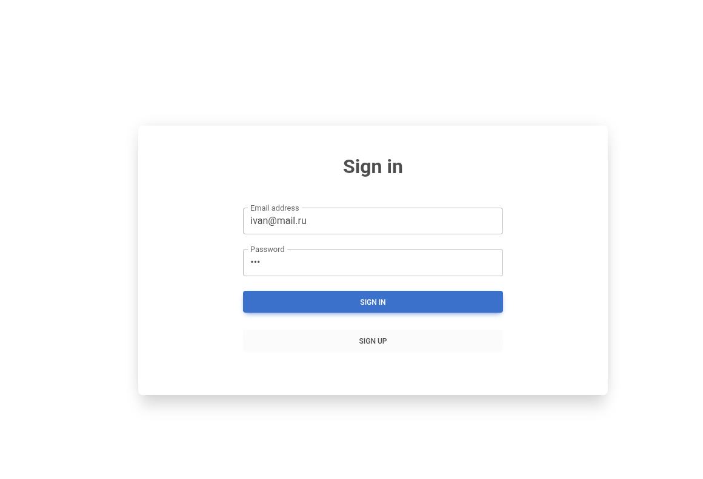
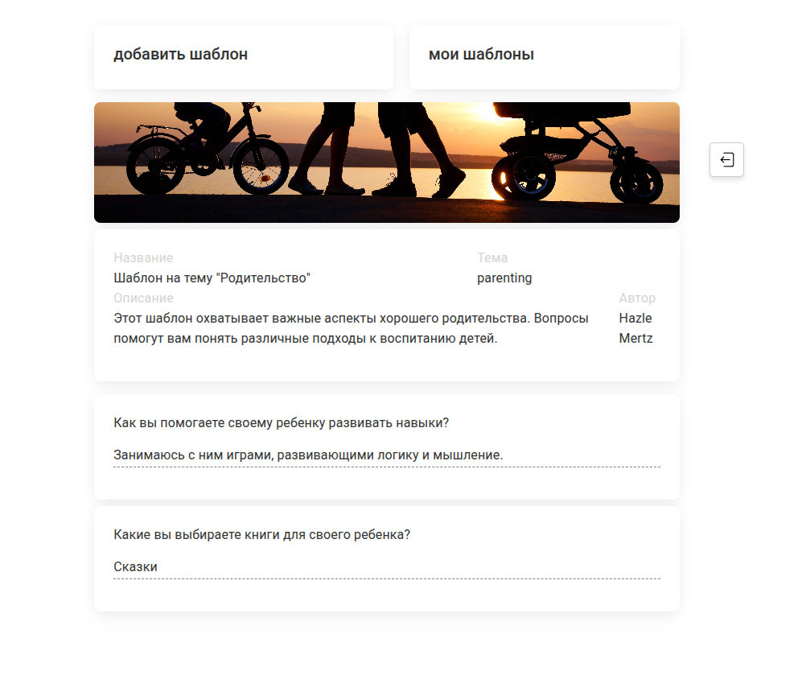

# Questionnaire

## Проект

Веб-приложение для создания и управления опросниками с системой ролей пользователей.

## Описание

Платформа позволяет создавать шаблоны опросов, настраивать вопросы, добавлять изображения и просматривать ответы респондентов. Пользователи работают в разных ролях (администратор, автор шаблона, пользователь) с разграничением прав доступа.  
Фронтенд взаимодействует с бэкендом через REST API с передачей cookies (`withCredentials`).

## Скриншоты

Файлы лежат в [`docs/screenshots/`](docs/screenshots/). Ниже — актуальные изображения интерфейса.

### Главная: каталог шаблонов

Сетка карточек с тематическими анкетами (поиск в шапке, выход из аккаунта).



### Просмотр шаблона (примеры экранов)





### Личный кабинет: таблица «Мои шаблоны»

Список созданных шаблонов с действиями (редактирование, удаление, заполненные формы).



### Создание / редактирование шаблона





### Вход в систему



### Заполненная анкета (просмотр ответов)



Добавить новый скрин: положите файл в `docs/screenshots/` и вставьте в этот раздел строку:

```markdown

```

## Технологии

- **Web:** React 18, React Router 6, Material UI, Axios, `@hello-pangea/dnd`, MDBootstrap, Chart.js, CRACO, Sass
- **API:** Express.js, Node.js, Sequelize ORM
- **Database:** MySQL
- **Media:** Cloudinary
- **Сборка web:** Create React App + CRACO

## Что реализовано

- Система ролей пользователей (администратор, автор шаблона, пользователь) с разграничением прав доступа
- Интерфейс создания и редактирования шаблонов опросов с разными типами вопросов
- Drag-and-drop конструктор на `@hello-pangea/dnd`: изменение порядка вопросов и вариантов ответов через перетаскивание
- Загрузка изображений шаблонов в Cloudinary (без хранения медиафайлов на сервере приложения)
- Взаимодействие frontend и backend через REST API (`Axios`)
- Работа с MySQL через Sequelize ORM
- Использование Material UI (включая `Autocomplete`) для выбора тегов и параметров шаблона
- Отображение и хранение ответов пользователей
- Структура фронтенда по слоям FSD: `app`, `pages`, `widgets`, `features`, `entities`, `shared` (см. ниже)

## Слабые места и план улучшений

- `TemplateContext` — god-object (30+ значений в контексте); разбить на несколько контекстов или перейти на Redux для снижения ре-рендеров
- Крупный слайс `features/template-editor`; позже разбить на `entities/template` и отдельные `features`
- `questions` и `config.questionList` — параллельные массивы, синхронизируются вручную; рассмотреть объединение в единую структуру
- Пустые `catch`-блоки в auth и API-хуках — добавить пользовательскую обратную связь при ошибках (особенно `SignIn`)
- Нет строгого разделения DTO / view-моделей
- RTK Query или единый API-слой, унифицировать обработку ошибок, публичные API слайсов через `index.js`
- Интеграционные тесты маршрутов

## Структура FSD (фронтенд)

```
web/src/
├── app/                          # корень приложения (маршруты, провайдеры)
│   └── App.js
├── pages/                        # страницы (тонкая композиция)
│   ├── main-page/
│   ├── sign-in/                  # re-export из features/auth
│   ├── sign-up/
│   ├── home/
│   ├── all-templates-block/
│   └── selected-template/
├── widgets/                      # крупные составные блоки
│   ├── layout-with-header/
│   ├── app-header/               # шапка, меню
│   └── statistics-dashboard/     # блок с графиками на главной
├── features/
│   ├── auth/ui/                  # SignIn, SignUp, кнопки входа/выхода
│   ├── history-navigation/model/ # HistoryContext
│   └── template-editor/          # шаблоны, формы, хуки, редьюсер
│       ├── model/                # TemplateContext, configReducer, hooks, hocs
│       └── ui/template/, ui/my-templates/
├── entities/
│   └── session/model/            # AuthContext (сессия пользователя)
└── shared/                       # api, config, lib, ui (обёртки, стили)
```

Для обратной совместимости со старыми импортами в корне `web/src` остаются re-export: `Requests.js`, `const/`, `utilits/`, `storage/`, `url/`, `App.js`.

## Changelog

### Security hardening (БЛОК 1)

- Удалены захардкоженные Salesforce-креденшалы из `server.js` — перенесены в `.env` (`SF_CLIENT_ID`, `SF_CLIENT_SECRET`, `SF_USERNAME`, `SF_PASSWORD`)
- Session secret вынесен в переменную окружения `SESSION_SECRET`
- Добавлен `helmet`, `cors`, `express-rate-limit` (20 попыток / 15 мин на auth-роуты)
- Защищены роуты: `DELETE /template/:id`, `POST /upload`, `POST /salesforce/createCustomer` — добавлен `isAuthenticated`
- Исправлен error handler в `/upload`; добавлена валидация типа и размера файла (JPEG/PNG/GIF/WebP, до 5 MB)
- Пароль больше не возвращается в JSON-ответах при signIn/signUp
- Cookie: `sameSite: 'lax'`, `secure` в production
- Создан `.env.example`

### API layer (БЛОК 2)

- Централизованный axios instance с `baseURL: '/api'` и `withCredentials`
- Response interceptor для 401
- Убраны бесполезные try/catch-обёртки из request-функций
- Все вызовы API используют пути относительно `/api`
- Убран `window.location.origin` хак из `TemplateContext.saveForm`

### TemplateContext (БЛОК 3)

- Убран дублирующийся вызов `setFilledFormId(null)`
- Добавлены корректные dependency arrays во все `useEffect` и `useCallback`
- `safeParse` хелпер для `localStorage` (защита от краша на невалидных данных)
- Optional chaining для `user.id` в `saveForm`

### DnD wrappers (БЛОК 4)

- `useDragDropWrapper` → `createDragDropWrapper` (фабричная функция, не хук)
- `useDraggableWrapper` → `createDraggableWrapper` (фабричная функция, не хук)
- Убран неиспользуемый импорт `useEffect`

### Code cleanup (БЛОКИ 1-4 ревью)

- Удалены все дебажные `console.log` из фронтенда (38 шт.)
- Удалены все нарративные комментарии и закомментированный код
- Исправлены захардкоженные тестовые креденшалы в `SignIn` (заменены на пустые строки)
- Исправлен unsafe `error.response.data.message` → `error.response?.data?.message`
- Исправлен `useState([])` → `useState({})` в `SignUp`
- `FormData` в `useUploadImg` перенесён внутрь функции (ранее захватывал stale `imgUrl`)
- Убрано логирование PII из серверных контроллеров

### configReducer (БЛОК 5)

- Выделены `CONFIG_ACTIONS` константы в `configActionTypes.js`
- Все строковые литералы заменены на `CONFIG_ACTIONS.*` в reducer, context, hooks
- `REMOVE_QUESTION` принимает `id`, фильтрует и переиндексирует внутри через `recalculateIds`
- `TOGGLE_QUESTION_MODE` — early-return паттерн
- `RESET_QUESTION_LIST` — добавлен `...state` spread
- Добавлены тесты: REMOVE (filter + reindex), TOGGLE (оба направления + edge case), RESET

## Как запустить

Из корня репозитория (после `npm run install-dependencies` или ручного `npm install` в `web` и `api`):

- **API:** `npm run start:api:dev` или `cd api && npm start`
- **Web (dev):** `cd web && npm start`
- **Сборка web:** `cd web && npm run build`

Алиас импортов: `@/*` → `web/src/*` (настроено в `web/jsconfig.json` и `web/craco.config.js`).

**Сборка в CI:** при `CI=true` Create React App считает предупреждения ESLint ошибками; в проекте остаются предупреждения в legacy-коде (`features/template-editor` и др.). До их устранения локально используйте `CI=false npm run build` или задайте `DISABLE_ESLINT_PLUGIN=true` на время сборки (не рекомендуется как постоянное решение).
